## Gitlab CI/CD，在iOS开发中应用

### 前言
> Gitlab代码管理：这里测试案例直接将项目放到官方提供的gitlab 个人账号下，公司/团队可在自身服务器上搭建一套GitLab代码管理会更加安全(可将需求抛给运维同学,稍具规模的公司都会搭建属于自己的git/svn)。  
>CICD官网简介[https://docs.gitlab.com/ee/ci/README.html](https://docs.gitlab.com/ee/ci/README.html)  

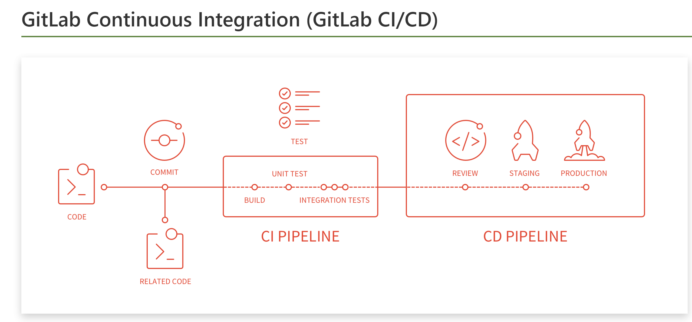
### 一、基本概念  
#### 1.1. CI/CD  
CI，Continuous Integration，为持续集成。即在代码构建过程中持续地进行代码的集成、构建、以及自动化测试等；有了 CI 工具，我们可以在代码提交的过程中通过单元测试等尽早地发现引入的错误；  
CD，Continuous Deployment，为持续交付。在代码构建完毕后，可以方便地将新版本部署上线，这样有利于快速迭代并交付产品。  
#### 1.2. GitLab CI/CD  
GitLab CI/CD（后简称 GitLab CI）是一套基于 GitLab 的 CI/CD 系统，可以让开发人员通过 .gitlab-ci.yml 在项目中配置 CI/CD 流程，在提交后，系统可以自动/手动地执行任务，完成 CI/CD 操作。而且，它的配置非常简单，CI Runner 由 Go 语言编写，最终打包成单文件，所以只需要一个 Runner 程序、以及一个用于运行 jobs 的执行平台（如裸机+SSH，Docker 或 Kubernetes 等，我推荐用 Docker，因为搭建相当容易）即可运行一套完整的 CI/CD 系统。  

**Job**  
>job 为任务，是 GitLab CI 系统中可以独立控制并运行的最小单位。 在提交代码后，开发者可以针对特定的 commit
完成一个或多个 job，从而进行 CI/CD 操作。  

**Pipeline**
>Pipeline 即流水线，可以像流水线一样执行多个 Job. 在代码提交或 MR 被合并时，GitLab 可以在最新生成的 commit
上建立一个 pipeline，在同一个 pipeline 上产生的多个任务中，所用到的代码版本是一致的。  

**Stage**
>一般的流水线通常会分为几段；在 pipeline中，可以将多个任务划分在多个阶段中，只有当前一阶段的所有任务都执行成功后，下一阶段的任务才可被执行。  

***注：如果某一阶段的任务均被设定为“允许失败”，那这个阶段的任务执行情况，不会影响到下一阶段的执行。***   

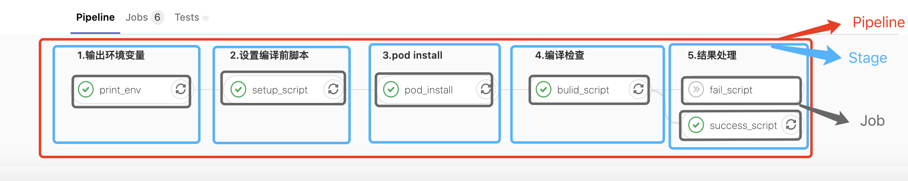  
>上图整条流水线从左向右依次执行，每一列均为一个阶段，而列中的每个可操控元素均为任务。 这里五个阶段的任务是自动执行的任务，在commit或request merge(根据gitlab-ci Job条件) 提交后即可自动开始运行，执行成功或失败后，可以点击任务右边的按钮重试；如果需要手动触发执行任务需要在.gitlab-ci.yml任务里添加**when:manual**表示该操作只允许手动触发。  
>一个Pipeline对应多个Stage,每一个Stage可分成多个Job  

### 二、Gitlab-Runner安装/注册  
#### 2.1. 安装
官方安装文档[https://docs.gitlab.com/runner/install/](https://docs.gitlab.com/runner/install/)  
>针对iOS项目，准备一台空闲(团队使用)Mac OS电脑当做服务器，内网服务器能访问外网即可，在此服务器上安装Runner，后续ci/cd相关脚本亦在此运行    
>  

```shell
# MacOS
sudo brew install gitlab-ci-multi-runner

# For Debian/Ubuntu/Mint
sudo apt-get install gitlab-ci-multi-runner
 
# For RHEL/CentOS/Fedora
sudo yum install gitlab-ci-multi-runner
```

#### 2.2.注册
打开gitlab项目 -> Settings -> CI/CD -> Runners  
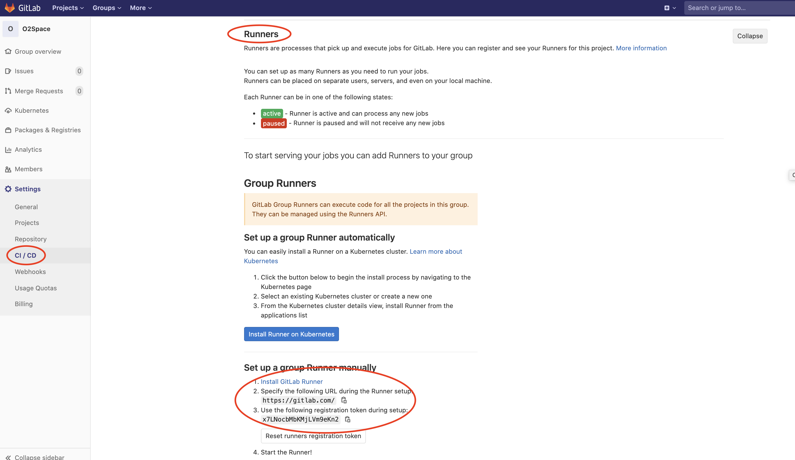

* 在安装Runner的服务器上运行注册  

```shell
sudo gitlab-runner register
```

* 输入你的GitLab URL,这里copy上图https://gitlab.com/

```shell
Please enter the gitlab-ci coordinator URL (e.g. https://gitlab.com):
https://gitlab.com/
```

* 输入 注册令牌 来注册 Runner,这里copy上图token

```shell
Please enter the gitlab-ci token for this runner:
wfjVq8G..我是马赛克..LoZ
```

* 输入 Runner 说明

```shell
Please enter the gitlab-ci description for this runner:
iOSTeamRunner
```

* 输入 Runner 的 tags

```shell
Please enter the gitlab-ci tags for this runner (comma separated):
iOSTeamRunner
```

* 输入 Runner 执行方式

```shell
Please enter the executor: ssh, docker+machine, docker-ssh+machine, kubernetes, docker, parallels, virtualbox, docker-ssh, shell:
shell
```
如下：
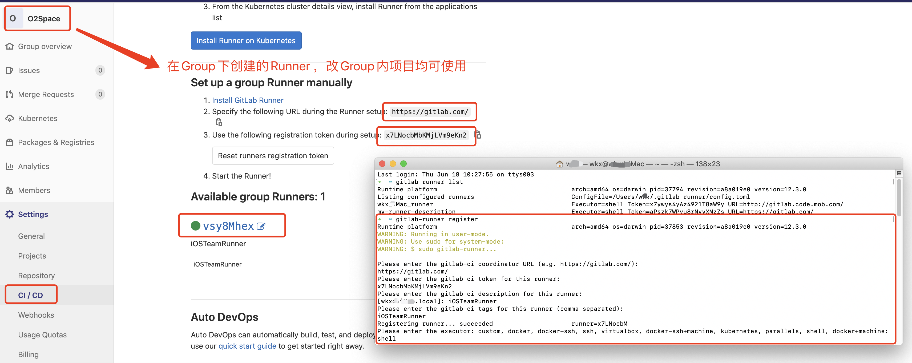

### 三、CI/CD 在iOS工程中的应用  
#### 3.1. 需求  
>**需求:**非项目负责人不允许对master主分支进行push、merge等修改代码相关操作，收回相关权限。开发者只能通过master分支创建一个开发分支进行项目迭代，一旦迭代完成，只能发起merge request让相关项目负责人将开发分支merge(合并)到master分支，为了保证合并之前开发分支代码是编译通过且打包无异常，需进行校验工作，让项目负责人清晰知道代码编译是正常的。所以引入了 Gitlab 下 CI/CD机制。  

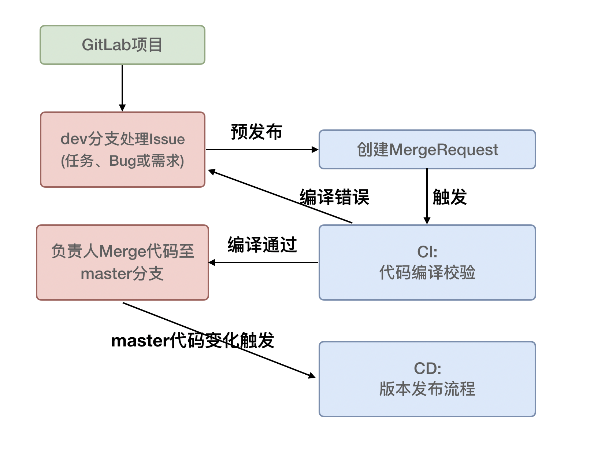

上图**"CD:版本发布流程"** 我们使用了jenkins进行自动化打包发布(当然也可以使用Gitlab来实现)，这里就不多描述  
这里主要关注上图**"CI:代码编译校验"**相关的.gitlab-ci.yml文件的编写。

#### 3.2. 环境
* gitlab代码管理，可以使用[官网](https://gitlab.com/),亦可自行搭建gitlab代码管理服务器
* 需要在一台电脑或服务器安装Runner，如何安装Runner请看上方“二、Gitlab-Runner安装/注册 ”
* 在安装Runner的设备上安装Xcode，因为我们的项目是iOS项目，编译打包工作需要此环境

#### 3.3. .gitlab-ci.yml文件  
>给工程项目添加gitlab-ci.yml文件

这里执行渠道(Pipeline)分成5个阶段(stage)

```
#GIT_STRATEGY: none
#GIT策略，定义拉取代码的方式，有3种：clone/fetch/none，默认为clone，速度最慢，每步job都会重新clone一次代码。我们一般将它设置为none，在具体任务里设置为fetch就可以满足需求，毕竟不是每步都需要新代码，那也不符合我们测试的流程
#在job中可以用${GIT_STRATEGY}来使用这个变量。常用的预定义变量有CI_COMMIT_REF_NAME（项目所在的分支或标签名称），CI_JOB_NAME（任务名称），CI_JOB_STAGE（任务阶段）

before_script:
  - |
    ifconfig | grep "inet "
    pwd
#    export LANG="en_US.UTF-8" 
#    export
# 全局变量，保证不同stage不会每次重置代码
# 某些步骤需要可以在Job中添加（如结果回调中）

#after_script:
#  - |
#    pwd

stages:
  - 1.输出环境变量
  - 2.设置编译前脚本
  - 3.pod install
  - 4.编译检查
  - 5.结果处理

#1.输出环境变量
#gitlab系统自带环境变量：http://gitlab.code.mob.com/help/ci/variables/predefined_variables.md
print_env: 
  stage: 1.输出环境变量
  script:
    - export LANG="en_US.UTF-8" 
    - export
    #- echo "==================================================="
    #- echo "project_name:${O2Space_ProjectName}"
    #- echo "project_workspace:${O2Space_WorkSpace}"
    #- echo "sdk_schemes:${O2Space_SDKSchemes}"
    #- echo "ipa_scheme:${O2Space_IPAScheme}"
    #- echo "==================================================="
  only:
    - merge_requests
  tags:
    - iOSTeamRunner
  variables:
    GIT_STRATEGY: none

#2.设置编译前脚本
# 开启自身clone项目 及 clone/fetch 相关封装shell脚本
setup_script: 
  stage: 2.设置编译前脚本
  script:
    - |
      if [ -d ToolScript ]; then
        #企业微信获取token存储时文件创建需要权限
        chmod u+w ToolScript
        builtin cd ToolScript
        git fetch
        git reset --hard origin/master
        chmod +x ./project_build_check.sh
        chmod +x ./qiyewechat_sendMsg_api.sh
        builtin cd ..
      else
        #添加ssh,否则git clone将无权限
        username="wukx"
        ssh_PATH="/Users/wkx/Documents/Develop/.ssh/${username}_rsa"
        eval $(ssh-agent)
        ssh-add $ssh_PATH
        #将shell脚本放到ToolScript项目里便于管理
        git clone git@gitlab.com:O2Space/ToolScript.git
        ssh-agent -k
      fi
      #当前Gitlab账号
      users=${GITLAB_USER_LOGIN}
      eventContent=""
      if [ ${CI_PIPELINE_SOURCE} = "merge_request_event" ]; then
        eventContent="您发起了merge请求，正在为您进行代码校验 \n项目：${CI_PROJECT_PATH}，\n发起分支：${CI_MERGE_REQUEST_SOURCE_BRANCH_NAME}，\n目标分支：${CI_MERGE_REQUEST_TARGET_BRANCH_NAME}"
      fi
      #发送企业微信消息，通知发起者，开始编译校验 
      type=1
      builtin cd ToolScript
      source qiyewechat_sendMsg_api.sh -u "${users}" -c "${eventContent}" -y "${type}"
      builtin cd ..
  only:
    - merge_requests
  tags:
    - iOSTeamRunner
  variables:
    GIT_STRATEGY: clone

#3.pod install
pod_install:
  stage: 3.pod install
  script:
    - |
      pwd
      echo "此项目无需通过Pod集成第三方SDK"
#      source pod install
  only:
    - merge_requests
  tags:
    - iOSTeamRunner
  variables:
    GIT_STRATEGY: none

#4.编译检查
bulid_script:
  stage: 4.编译检查
  script:
    - |
      project_dir=`pwd`
      project_name=${O2Space_ProjectName}
      project_workspace=${O2Space_WorkSpace}
      sdk_schemes=${O2Space_SDKSchemes}
      ipa_scheme=${O2Space_IPAScheme}
      echo $project_dir
      echo "project_name:${project_name}"
      echo "project_workspace:${project_workspace}"
      echo "sdk_schemes:${sdk_schemes}"
      echo "ipa_scheme:${ipa_scheme}"
      chmod +x ToolScript/project_build_check.sh
      source ToolScript/project_build_check.sh "${project_dir}" "${project_name}" "${project_workspace}" "${sdk_schemes}" "${ipa_scheme}"
  only:
    - merge_requests
  tags: 
    - iOSTeamRunner
  variables:
    GIT_STRATEGY: none

#5.结果处理
fail_script:
  stage: 5.结果处理
  script:
    - |
      echo "校验失败"
      users=${GITLAB_USER_LOGIN}
      timeStr=$(date "+%Y-%m-%d %H:%M:%S")
      title="Gitlab操作：代码编译校验结果通知"
      branchInfo=${CI_BUILD_REF_NAME}
      eventContent=""
      weblink=""
      if [ ${CI_PIPELINE_SOURCE} = "merge_request_event" ]; then
        branchInfo=${CI_MERGE_REQUEST_SOURCE_BRANCH_NAME}→${CI_MERGE_REQUEST_TARGET_BRANCH_NAME}
        eventContent=${CI_MERGE_REQUEST_TITLE}
        weblink=${CI_MERGE_REQUEST_PROJECT_URL}/merge_requests/${CI_MERGE_REQUEST_IID}
      fi
      description="<div class='gray'>${timeStr}</div>
                  <div class='normal'>项目:${CI_PROJECT_PATH}</div>
                  <div class='normal'>事件:${CI_PIPELINE_SOURCE}</div>
                  <div class='normal'>涉及分支:${branchInfo}</div>
                  <div class='normal'>事件内容:${eventContent}</div>
                  <div class='normal'>pipeline:${CI_PIPELINE_ID}</div>
                  <div class='highlight'>校验结果：失败</div>"
      type=2
      builtin cd ToolScript
      source qiyewechat_sendMsg_api.sh -u "${users}" -t "${title}" -d "${description}" -l "${weblink}" -y "${type}"
      builtin cd ..
  when: on_failure
  only: 
    - merge_requests
  tags: 
    - iOSTeamRunner
  variables:
    GIT_STRATEGY: none

#5.结果处理
success_script:
  stage: 5.结果处理
  script:
    - |
      echo "校验成功"
      users=${GITLAB_USER_LOGIN}
      resultStr=""
      if [ ! -n "$O2Space_MergeOwner" ]; then
        echo "O2Space_MergeOwner is null"
      else
        users=${users},${O2Space_MergeOwner}
        resultStr="，请相关人员:${O2Space_MergeOwner}，进行merge操作"
      fi
      timeStr=$(date "+%Y-%m-%d %H:%M:%S")
      title="Gitlab操作：代码编译校验结果通知"
      branchInfo=${CI_BUILD_REF_NAME}
      eventContent=""
      weblink=""
      if [ ${CI_PIPELINE_SOURCE} = "merge_request_event" ]; then
        branchInfo=${CI_MERGE_REQUEST_SOURCE_BRANCH_NAME}→${CI_MERGE_REQUEST_TARGET_BRANCH_NAME}
        eventContent=${CI_MERGE_REQUEST_TITLE}
        weblink=${CI_MERGE_REQUEST_PROJECT_URL}/merge_requests/${CI_MERGE_REQUEST_IID}
      fi
      description="<div class='gray'>${timeStr}</div>
                  <div class='normal'>项目:${CI_PROJECT_PATH}</div>
                  <div class='normal'>事件:${CI_PIPELINE_SOURCE}</div>
                  <div class='normal'>涉及分支:${branchInfo}</div>
                  <div class='normal'>事件内容:${eventContent}</div>
                  <div class='normal'>pipeline:${CI_PIPELINE_ID}</div>
                  <div class='blue'>校验结果：成功${resultStr}</div>"
      type=2
      builtin cd ToolScript
      source qiyewechat_sendMsg_api.sh -u "${users}" -t "${title}" -d "${description}" -l "${weblink}" -y "${type}"
      builtin cd ..
  when: on_success
  only: 
    - merge_requests
  tags: 
    - iOSTeamRunner
  variables:
    GIT_STRATEGY: none

```

[gitlab系统自带环境变量](http://gitlab.code.mob.com/help/ci/variables/predefined_variables.md)、自定义的变量。  
  
**自定义变量配置：**
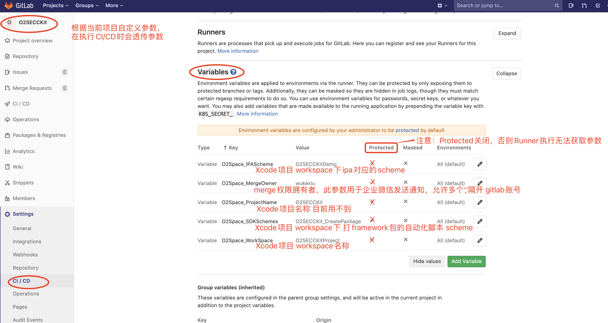

**通知：**
通过企业微信Api接口发送通知到开发者微信上，这里通知功能封装在qiyewechat\_sendMsg\_api.sh的shell文件里，此文件在项目“scripts”里，所以脚本任务中执行git clone项目  
**qiyewechat\_sendMsg\_api.sh文件：**

```
#!/bin/bash

#用法提示
usage() {
    echo "Usage:"
    echo "  qiyewechat_sendMsg_api.sh [-u USER] [-t TITLE] [-c CONTENT] [-d DETAIL] [-p PICTURE] [-l LINK] [-y TYPE]"
    echo "Description:"
    echo "    USER, 用户."
    echo "    TITLE, 标题."
    echo "    CONTENT, 内容."
    echo "    DETAIL, 细节."
    echo "    PICTURE, 图片."
    echo "    LINK, 链接."
    echo "    TYPE, 内容类型."
    exit -1
}


# 获取脚本执行时的选项
while getopts u:t:c:d:p:l:y: option
do
   case "${option}"  in
                u) USER=${OPTARG};;
                t) TITLE=${OPTARG};;
                c) CONTENT=${OPTARG};;
                d) DETAIL=${OPTARG};;
                p) PICTURE=${OPTARG};;
                l) LINK=${OPTARG};;
                y) TYPE=${OPTARG};;
                h) usage;;
                ?) usage;;
   esac
   echo $option
   echo $OPTARG

done

#gitlab用户 匹配 企业微信通讯录用户账号
function getQiyewechatUserId(){
  local str=(`cat ./user_table.txt | awk -F ' ' '{print $1}'`)
  local userid=""
  local params=$@
  for i in ${!str[@]}
  do
    arr=(${str[i]//:/ })
    
    if [ ${arr[0]} == ${params[0]} ]; then
      echo ${arr[1]}
    fi 
  done

  echo ${userid}
}

function getQiyewechatUserIds(){
  local params=$@
  local userids=""
  arr=(${params//,/ })
  for i in ${!arr[@]}
  do
    tmp_str=$(getQiyewechatUserId ${arr[i]})
    if [[ $i != 0 ]]; then
      tmp_str=\|${tmp_str}
    fi
    userids=${userids}${tmp_str}
  done
  echo ${userids}
}

userids=$(getQiyewechatUserIds $USER)
echo userids:${userids}
# exit 0

#api的相关参数
#企业id
corpid='ww93f2060b7af1b265'
#企业下创建应用id
agentId=1000002
corpsecret='kaoVjgw1Qi2lnvqjBJbbxAl3mTkYCKq7sk7eOZyFA7Y'


#RESTFUL API 接口相关参数
HOST=https://qyapi.weixin.qq.com


#获取token
wechat_api_token=${HOST}/cgi-bin/gettoken
#例子:
#GET:https://qyapi.weixin.qq.com/cgi-bin/gettoken?corpid=""&corpsecret=""
#返回内容:
#{
#       "errcode":0
#       "errmsg": ok
#       "access_token":"",
#       "expires_in": 7200,
#}


#发送消息
wechat_api_sendText=${HOST}/cgi-bin/message/send
#例子:
#POST: https://qyapi.weixin.qq.com/cgi-bin/message/send?access_token=ACCESS_TOKEN
#文本消息:
#{
#   "touser" : "UserID1|UserID2|UserID3"
#   "toparty" : "PartyID1|PartyID2",
#   "totag" : "TagID1 | TagID2",
#   "msgtype" : "text",
#   "agentid" : 1,
#   "text" : {
#       "content" : "你的快递已到，请携带工卡前往邮件中心领取。\n出发前可查看<a href=\"http://work.weixin.qq.com\">邮件中心视频实况</a>，聪明避开排队。"
#   },
#   "safe":0,
#   "enable_id_trans": 0
#}
#
#文本卡片消息:
#{
#   "touser" : "UserID1|UserID2|UserID3",
#   "toparty" : "PartyID1 | PartyID2",
#   "totag" : "TagID1 | TagID2",
#   "msgtype" : "textcard",
#   "agentid" : 1,
#   "textcard" : {
#            "title" : "领奖通知",
#            "description" : "<div class=\"gray\">2016年9月26日</div> <div class=\"normal\">恭喜你抽中iPhone 7一台，领奖码：xxxx</div><div class=\"highlight\">请于2016年10月10日前联系行政同事领取</div>",
#            "url" : "URL",
#            "btntxt":"更多"
#    },
#   "enable_id_trans": 0
#}
#
#图文消息:
# {
#   "touser" : "UserID1|UserID2|UserID3",
#   "toparty" : "PartyID1 | PartyID2",
#   "totag" : "TagID1 | TagID2",
#   "msgtype" : "news",
#   "agentid" : 1,
#   "news" : {
#       "articles" : [
#           {
#               "title" : "中秋节礼品领取",
#               "description" : "今年中秋节公司有豪礼相送",
#               "url" : "URL",
#               "picurl" : "http://res.mail.qq.com/node/ww/wwopenmng/images/independent/doc/test_pic_msg1.png"
#           }
#        ]
#   },
#   "enable_id_trans": 0
# }

#返回内容:
#{
#   "errcode" : 0,
#   "errmsg" : "ok",
#   "invaliduser" : "userid1|userid2", // 不区分大小写，返回的列表都统一转为小写
#   "invalidparty" : "partyid1|partyid2",
#   "invalidtag": "tagid1|tagid2"
# }


# 获取token
function getAccessToken {
   token_url="${wechat_api_token}?corpid=${corpid}&corpsecret=${corpsecret}"
   curl -d "" -X GET $token_url > token.json
   token=$(cat token.json | python -c "import sys, json; print(json.load(sys.stdin)['access_token'])")
   echo $token
}

token=$(getAccessToken)
echo token:$token

send_content=""
  
if [ $TYPE -eq 1 ] 
  then
    send_content="{
      \"touser\":\"$userids\",
      \"agentid\":\"$agentId\",
      \"msgtype\":\"text\",
      \"text\":{\"content\":\"$CONTENT\"},
      \"safe\":0,
      \"enable_id_trans\":0
      }"
elif [ $TYPE -eq 2 ] 
  then
    send_content="{
      \"touser\":\"$userids\",
      \"agentid\":\"$agentId\",
      \"msgtype\":\"textcard\",
      \"textcard\":{
            \"title\":\"$TITLE\",
            \"description\":\"$DETAIL\",
            \"url\":\"$LINK\",
            \"btntxt\":\"更多\"
      },
      \"enable_id_trans\":0
    }"
elif [ $TYPE -eq 3 ] 
  then
   send_content="{
      \"touser\":\"$userids\",
      \"agentid\":\"$agentId\",
      \"msgtype\":\"news\",
      \"news\":{
          \"articles\":[{
              \"title\":\"$TITLE\",
              \"description\":\"$DETAIL\",
              \"url\":\"$LINK\",
              \"picurl\":\"$PICTURE\"
          }]
      },
    \"enable_id_trans\":0
    }"
fi


echo -e $send_content > "send_content.json"
send_url="${wechat_api_sendText}?access_token=${token}"
echo $send_url
curl  --write-out %{http_code} -d '@send_content.json' -X POST ${send_url} > sendResult.json


```

**用户对应企业微信账号,user\_table.txt文件：**  
gitlab账号:企业微信账号

```
wukexiu:WuKeXiu
```

这里才是正在的编译校验任务，当然真正校验的实现在project\_build\_check.sh中(里面有对xcode的项目进行编译，打包)  
**project\_build\_check.sh文件:**

```
##!/bin/sh

######################
#此shell用于项目编译校验#
######################

#in other shell, source project_build_check.sh 在同一个shell下执行共享参数
echo "PROJECTNAME:${O2Space_ProjectName}"
echo "WORKSPACE:${O2Space_WorkSpace}"
echo "SDK_SCHEMES:${O2Space_SDKSchemes}"
echo "IPA_SCHEME:${O2Space_IPAScheme}"

# 第一步
echo "第一步 变量配置" 

pwd

project_path=$1

project_name=$2

# workspace名
project_workspace=$3

#多个Scheme名用“,”分割
sdk_schemes=$4

ipa_scheme=$5
if [ -z "$ipa_scheme" ]; then
    ipa_scheme=$project_name
fi

# archive_path        eg:$project_path/$project_name.xcarchive
archive_path=$project_path/$ipa_scheme.xcarchive

# ipa文件存放路径        eg:$project_path/$project_name.ipa
export_ipa_path=$project_path/$ipa_scheme.ipa

# exportOptions plist       eg:$project_path/ExportOptions.plist
# 打包导出ipa的时候会生成记录了这次导出时的证书及关键配置
export_options_plist=$project_path/ExportOptions.plist

# 编译模式
build_type=Release

# 第二步
echo "第二步 清理工程-打包-导出"


#echo "选择Xcode版本" | sudo -S xcode-select -s /Applications/Xcode10.1.app

if [ -n "$sdk_schemes" ]; then
  sdk_scheme_array=(${sdk_schemes//,/ })
  echo "///-----------"
  echo "/// 正在打包SDK"
  echo "///-----------"
  for scheme in ${sdk_scheme_array[@]}
  do
    echo "///------------------------"
    echo "/// 正在编译$scheme"
    echo "///------------------------"
    # 安装xcpretty 可以让编译输出格式化
    #xcodebuild clean -project ${project_name}.xcodeproj -scheme $scheme | xcpretty
    #-derivedDataPath build,编译路径为当前build文件
    xcodebuild -workspace ${project_workspace}.xcworkspace -scheme $scheme -configuration $build_type -derivedDataPath build build -quiet || exit
  done
fi

if [ -z "$ipa_scheme" ]; then
  echo "打包ipa的scheme为nil"
  exit 1
fi

echo "///---------------"
echo "/// 正在清理Demo工程"
echo "///---------------"
xcodebuild clean -workspace ${project_workspace}.xcworkspace -scheme $ipa_scheme -configuration $build_type -quiet || exit


## 打IPA方式一: xcodebuild archive + xcodebuild -exportArchive,需要exportOptionsPlist，(可以手动打包一次，将exportOptionsPlist拷贝一份)
# echo "///------------------------"
# echo "/// 正在编译Demo工程: Release"
# echo "///------------------------"
# xcodebuild archive -workspace ${project_workspace}.xcworkspace -scheme ${ipa_scheme} -configuration Debug -archivePath $archive_path -quiet || exit


# echo "///-------------------------------"
# echo "/// 开始导出ipa: ${export_ipa_path}"
# echo "///-------------------------------"
# export_options_plist这个需要手动打包一次将ExportOptions.plist拷贝出来
# xcodebuild -exportArchive -archivePath $archive_path -exportPath ${export_ipa_path} -exportOptionsPlist ${export_options_plist} -quiet || exit

# 打IPA方式二: xcodebuild build + xcrun
xcodebuild -workspace ${project_workspace}.xcworkspace -scheme $ipa_scheme -configuration $build_type -derivedDataPath build build -quiet || exit

#Xcode升级到8.3后 用命令进行打包 提示下面这个错误
#xcrun: error: unable to find utility "PackageApplication", not a developer tool or in PATH
#新版的Xcode少了这个PackageApplication
#从旧版copy一份到“/Applications/Xcode.app/Contents/Developer/Platforms/iPhoneOS.platform/Developer/usr/bin/”下
xcrun -sdk iphoneos PackageApplication -v build/Build/Products/Release-iphoneos/$ipa_scheme.app -o $export_ipa_path || exit


if [[ -e $export_ipa_path ]]; then
    echo "///-----------"
    echo "/// ipa包已导出"
    echo "///-----------"
    #open $export_ipa_path
fi


# echo "第三步 发布到蒲公英或app store" 

# echo "///--------------------"
# echo "/// 开始发布到 app store"
# echo "///--------------------"
# altoolPath=/Applications/Xcode.app/Contents/Applications/Application\ Loader.app/Contents/Frameworks/ITunesSoftwareService.framework/Support/altool
# "$altoolPath" --validate-app -f $export_ipa_path\
#               -u <你的开发者账号> -p <你的开发者账号密码>\
#               --output-format xml
# "$altoolPath" --upload-app -f $export_ipa_path\
#               -u <你的开发者账号> -p <你的开发者账号密码>\
#               --output-format xml


# echo "///--------------------"
# echo "/// 开始上传ipa包到蒲公英"
# echo "///--------------------"
# curl -F "file=@${export_ipa_path}"\
#      -F "_api_key=5f36a500df15a2b22a195c1583cb8421" https://www.pgyer.com/apiv2/app/upload


# echo "///--------------------"
# echo "/// 开始上传ipa包到Fir"
# echo "///--------------------"
# fir login -T <你的token>
# fir publish $export_ipa_path

# 成功退出
exit 0

```

流程中任务发起和执行失败都会通过企业微信通知到发起者，全部执行成功通知发起者和Merge权限拥有者

#### 3.4. 相关效果图  
* 图一：发起merge request  
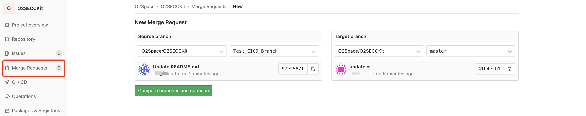

* 图二：触发CI,执行.gitlab-ci.yml中相关merge_request任务  
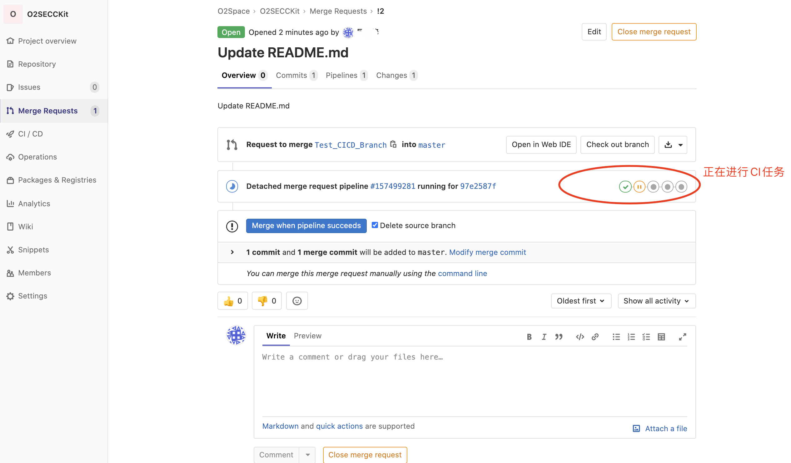

* 图三：任务执行完结果  
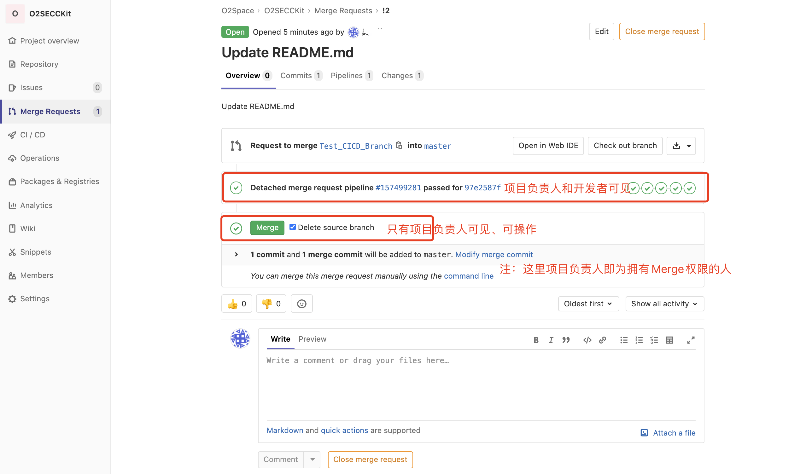

* 图四：查看Pipeline  
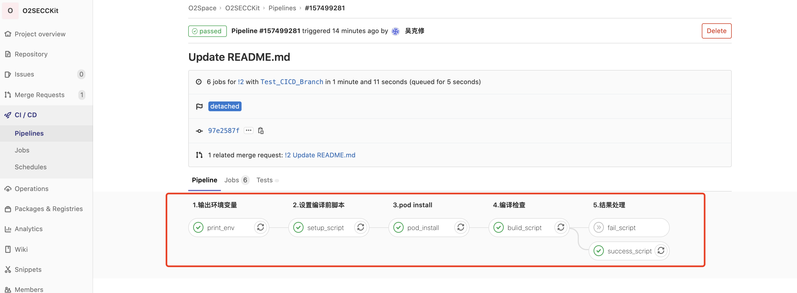

* 图五：微信通知信息  
>通过“企业微信”api发送通知到用户的“企业微信应用”，如何让微信也能接收呢？用微信关注对应的“企业微信”  

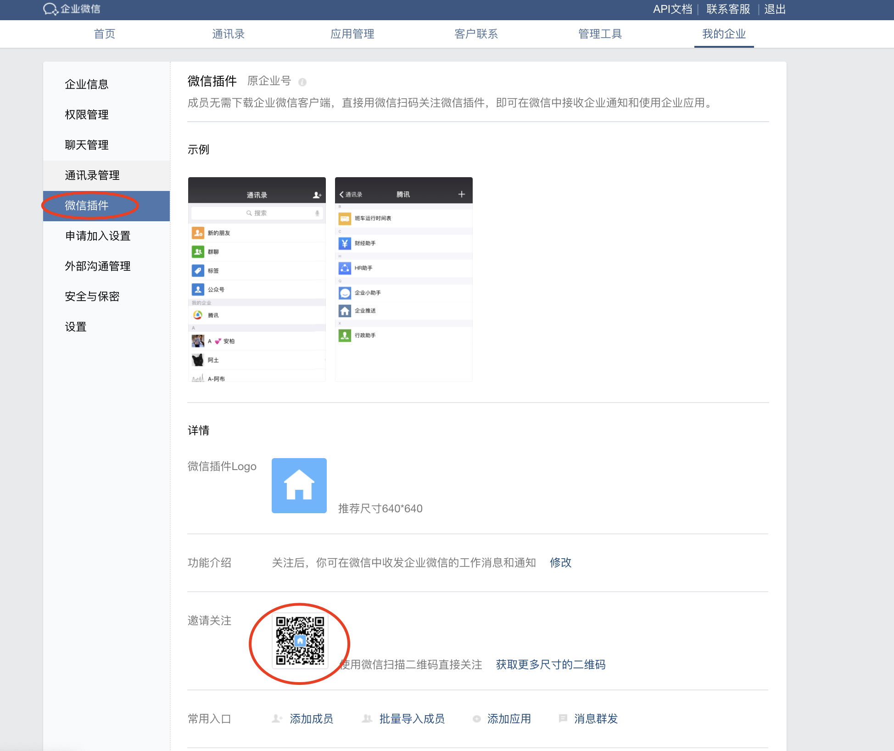

**微信内收到关注该“企业微信”的消息**  
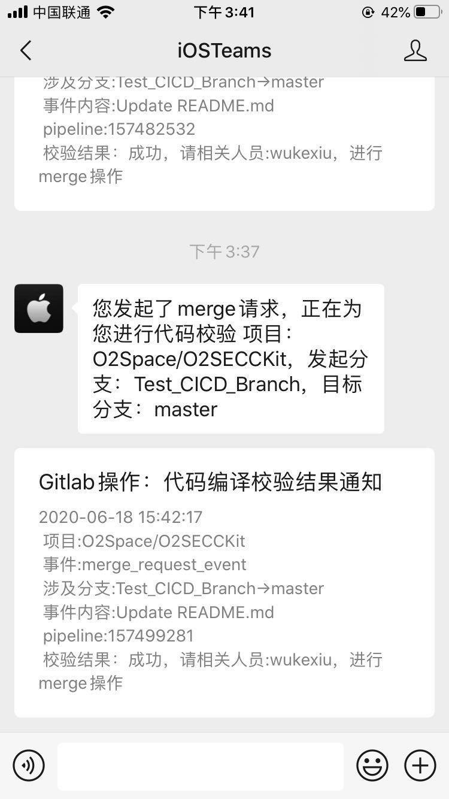  


### 四、完
